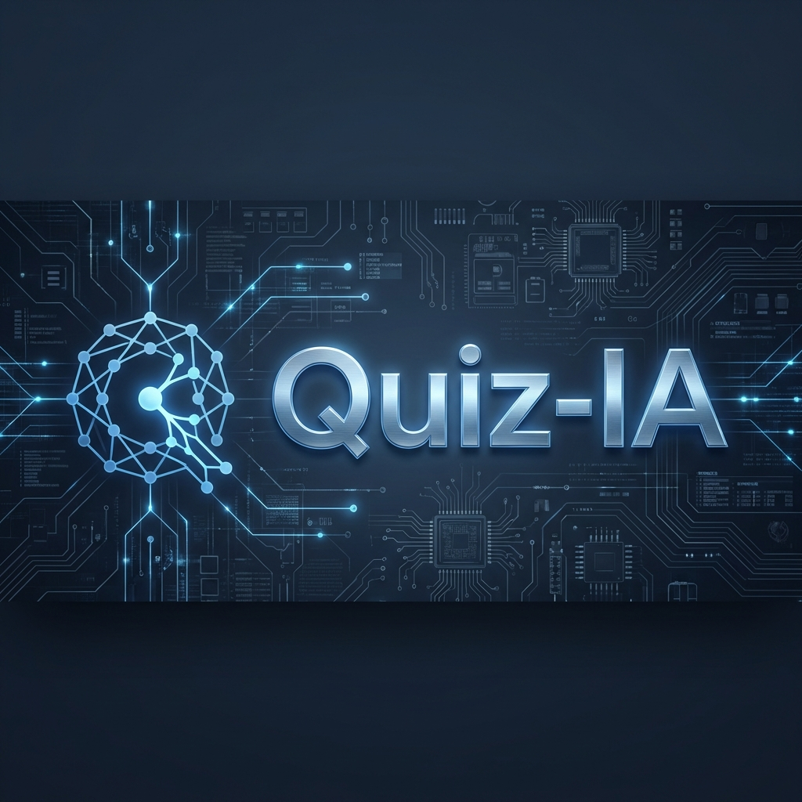

<p align="center">
  
</p>

# Quiz-IA 🚀
> **The ultimate AI-powered multi-subject learning platform.**

Quiz-IA is a premium educational tool designed to transform how students prepare for exams. By combining a stunning modern interface with powerful analytical features, it provides a high-performance environment for mastering any subject.

## ✨ Key Features

- 🎭 **Thematic Personalization**: Choose between Midnight, Forest, Sunset, and Ocean themes.
- ⏱️ **Exam Pro Timer**: Integrated circular countdown for timed pressure simulation.
- 📈 **Growth Analytics**: Visual progress tracking with interactive charts.
- 🏆 **Achievement System**: Unlock rewards as you master topics and maintain streaks.
- 📄 **Smart PDF Export**: Generate custom review guides containing only your incorrect answers.
- 📱 **Full PWA Support**: Optimized for desktop and mobile with offline capabilities.

## 🛠️ Technology Stack

- **Frontend**: React 18 & TypeScript
- **Styling**: Tailwind CSS v4 (Modern Engine)
- **Animations**: Framer Motion
- **Charts**: Recharts
- **PDF Engine**: jsPDF
- **Build Tool**: Vite

## 🚀 Getting Started

1. **Clone & Install:**
   ```bash
   git clone [your-repo-url]
   cd Quiz-IA
   npm install
   ```

2. **Development:**
   ```bash
   npm run dev
   ```

3. **Build for Production:**
   ```bash
   npm run build
   ```

## 📁 Project Structure

```text
src/
├── assets/branding/   # Logo and social banners
├── components/quiz/   # Interface components (Cards, Stats, Navigation)
├── hooks/             # Business logic (useQuizProgress, useAnswerEvaluation)
├── pages/             # Main views (Dashboard, Quiz)
├── styles/            # Tailwind v4 configuration
└── types/             # TypeScript definitions
```

---
<p align="center">
  Built with ❤️ for students worldwide.
</p>
